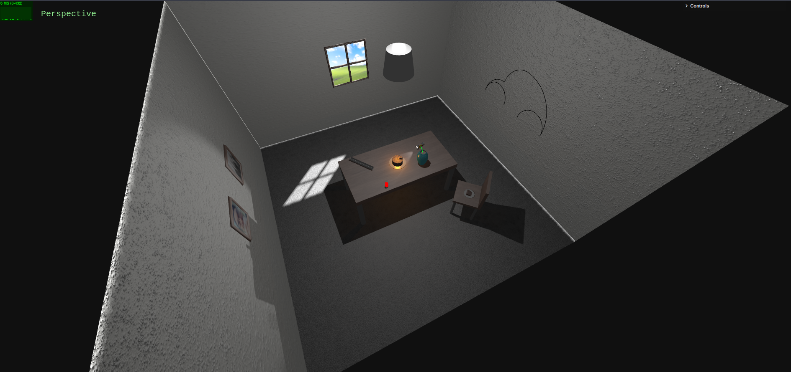

# SGI 2023/2024 - TP1

## Group T04G02

| Name                        | Number    | E-Mail                     |
| --------------------------- | --------- | -------------------------- |
| João António Semedo Pereira | 202007145 | <up202007145@edu.fe.up.pt> |
| Nuno Afonso Anjos Pereira   | 202007865 | <up202007865@edu.fe.up.pt> |

----

## Project information

- Varied use of materials, textures, light sources and cameras, as well as different types of geometry.
  - One strong point of our geometry use was the use of TorusGeometry for the picture frames, which simplified the creation of these objects.
- Scene
  - The created scene includes all required objects and light sources. In addition to this:
    - a directional light source was added to the scene, which is used to simulate the sun shining through the window. 
    - the required spotlight is not "hanging on the ceiling" like most groups that we know of have made, but instead is used as a flashlight on the table pointing at the cake. This has the advantage of displaying on the wall the shadows of the objects on top of the table, which is a nice effect.
    - The "missing" slice of the cake is also present in the scene, as it is a nice detail that we wanted to add.

----

## Issues/Problems

- In terms of creativity, although it exists, we feel like we could have done more. We tried to make the scene as realistic as possible, but we feel like we could have added more objects to the scene, or even more light sources.
- The scene consumes a lot of memory on the device. This might be due to the way we are grouping geometries and meshes, but more testing was needed.
- In order for the spotlight to correctly cast shadows, an helper had to be instantiated. On the final scene it is included as "debug information" but it is still needed for the spotlight's shadows to work correctly.
